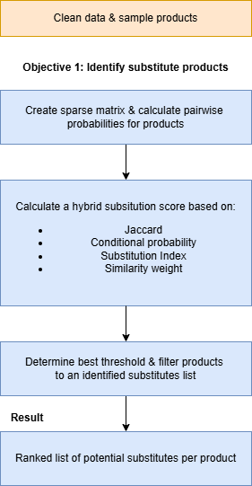

# Predicting Product Substitutes and Complements Using Basket-Level Data

## Context

Retailers regularly review their product assortment to determine which products to carry and which to delist, in order to maximize profit. When removing a product, its transferability — the percentage of its sales that will potentially be captured by other similar products — is a key consideration. Delisting products with high transferability pose less risk of revenue loss. In addition, a retailer should consider a product’s complements — products frequently bought together. This is relevant because listing or delisting a product may also affect the sales of its complements.

Existing research often uses choice models to estimate diversion ratios (or demand shift), requiring price, promotion and stockout data, which are often proprietary. Less explored in the literature is the use of basket-level data to predict both substitution and complementarity, offering a more accessible and behaviour-based approach. This enables retailers to estimate how delisting or listing a product may affect both substitutes and complements without relying on proprietary pricing data.
This project seeks to address how basket-level data can be used to model product substitution, and complementarity, and estimate how removing or introducing one product affects the demand for another in retail assortment decisions. The research questions build on one another and leverage different methodological approaches for a comprehensive analysis:

Which products are most likely to absorb sales if a particular product is removed?
Identifies potential substitutes and informs transferability estimates.

What percentage of sales from a removed product will be transferred to each substituting product?
Quantifies revenue impact and guides assortment decisions.

Which products are complementary to a particular product and thus may be affected if it is removed?
Identifies products whose sales are positively correlated, enabling retailers to anticipate effects of delisting on complementary products.

What is the impact of a product on the sales of complementary items?
Quantifies potential revenue loss or gain from complements when a product is removed, allowing more informed assortment planning.

## Dataset

This project will use the Instacart Online Grocery Shopping Dataset, publicly available and hosted on Kaggle: https://www.kaggle.com/datasets/yasserh/instacart-online-grocery-basket-analysis-dataset

Full EDA is available here: https://jenleap.github.io/big-data-analytics-project/eda_report_orders.html

## Object 1: Substitutes

The first objective focuses on identifying substitute products for a given focus product using a hybrid similarity–substitution framework. Instead of a traditional predictive model, this approach combines several behavioral and contextual indicators to quantify how likely two products are to be substitutes. The model integrates measures of product co-occurrence, contextual similarity, and exclusivity, producing an interpretable score that ranks potential substitutes.

Interaticve results are available here: https://jenleap.github.io/big-data-analytics-project/index.html

#### Units Tests

To run the units tests, in the command line run:
`python -m unittest discover -s tests -p "*.py"`

.

