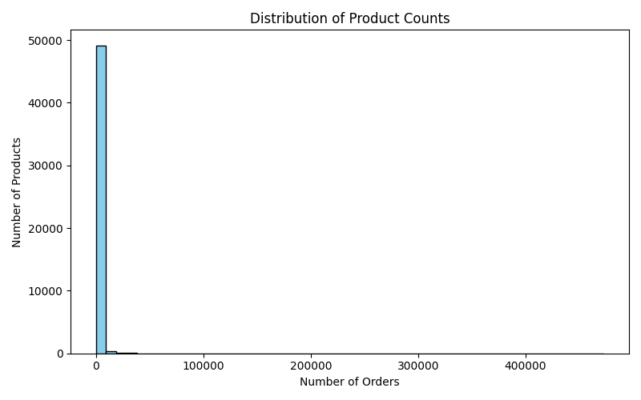

# Predicting Product Substitutes and Complements Using Basket-Level Data

This project will use the Instacart Online Grocery Shopping Dataset, publicly available and hosted on Kaggle: https://www.kaggle.com/datasets/yasserh/instacart-online-grocery-basket-analysis-dataset

Retailers regularly review their product assortment to determine which products to carry and which to delist, in order to maximize profit. When removing a product, its transferability — the percentage of its sales that will potentially be captured by other similar products — is a key consideration. Delisting products with high transferability pose less risk of revenue loss. In addition, a retailer should consider a product’s complements — products frequently bought together. This is relevant because listing or delisting a product may also affect the sales of its complements.

Existing research often uses choice models to estimate diversion ratios (or demand shift), requiring price, promotion and stockout data, which are often proprietary. Less explored in the literature is the use of basket-level data to predict both substitution and complementarity, offering a more accessible and behaviour-based approach. This enables retailers to estimate how delisting or listing a product may affect both substitutes and complements without relying on proprietary pricing data.

### Data Description

#### Order Size Distribution
This graph shows the distribution of basket sizes (number of products per order). Most orders contain 5–14 items, with a few unusually large baskets flagged as outliers, perhaps representing bulk or special orders.

#### User Order Frequency
This graph displays the number of orders placed per user. Most users place between 5–19 orders, while a small subset of high-frequency users have been flagged as outliers to prevent skewing average-based analyses.

#### Product Frequency
This graph illustrates how many baskets each product appears in. Most products are purchased infrequently, while a few popular products appear in a disproportionately large number of baskets. Both extremes have been flagged to aid interpretation and prevent skew in frequency-based metrics.

### Research Questions

Which products are most likely to absorb sales if a particular product is removed?

What percentage of sales from a removed product will be transferred to each substituting product?

Which products are complementary to a particular product and thus may be affected if it is removed?

What is the impact of a product on the sales of complementary items?

### Project Approach

<table>
  <tr>
    <th>Objective</th>
    <th>Methodology</th>
    <th>Reference</th>
  </tr>
  <tr>
    <td>Identify substitute products for a given product</td>
    <td>
        <ul>
            <li>Create a product-order matrix, where rows are orders and columns are products, values indicate whether a product was purchased (binary: 0 or 1)</li>
            <li>Calculate probabilities that product i and j appear together in same basket</li>
            <li>Calculate jaccard similarity and conditional purchase probability to identify products that appear in similar shopping contexts</li>
            <li>Calculate exclusivity-based substitution index (adapted from substitution and transfer models (Mani et al., 2016; Gayle & Lin, 2022))</li>
            <li>Normalize exclusivity, jaccard and conditional probability and combine into a hybrid score</li>
            <li>Rank candidate substitutes</li>
        </ul>
        Validation
        <ul>
            <li>Category consistency validation - substitute pairs should have high category overlap</li>
            <li>Behavioural validation - identify customers who used to buy A but stopped; check if these users later start buying B</li>
        </ul>
    </td>
    <td>
        <ul>
            <li>Sokol & Holý (2022): Demonstrate that basket-level similarity and co-occurrence patterns can infer substitute relationships without price data</li>
        </ul>
    </td>
  </tr>
  <tr>
    <td>Calculate what percentage of sales could be absorbed by substitute products if product A is delisted</td>
    <td>
        <ul>
            <li>From objective 1, select the top N substitutes for the target product A</li>
            <li>Calculate total baskets containing product A, total baskets containing each substitute, and total baskets containing the substitute but not A (compute these counts within categories, departments, or basket sizes to reduce noise and increase accuracy)</li>
            <li>Compute raw DTR (Demand Transfer Ratio)</li>
            <li>Adjust DTR with logistic regression and AME</li>
            <li>Convert adjusted DTRs to Pairwise Transfer Percent (PTP)</li>
            <li>Rank substitutes by PTP to identify top replacement products</li>
            <li>Sum PTPs across all substitutes to evaluate total sales absorption</li>
        </ul>
        Validation
        <ul>
            <li>Verify that the rank order of substitutes remains consistent between training and test data using Spearman’s rank correlation</li>
        </ul>
    </td>
    <td>
        <ul>
            <li>Gayle & Lin (2022): Provides DTR formula for estimating sales transfer between products</li>
            <li>Mani, Thomas & Bansal (2016): Shows regression-based adjustment corrects raw DTR for confounding factors, providing a more accurate estimate of substitution probability</li>
        </ul>
    </td>
  </tr>
  <tr>
    <td>Identify complementary products</td>
    <td>
        <ul>
            <li>Using the already calculated metrics co-occurrence probability, conditional probability and lift, construct a complementary network, where products are nodes and edges are weighted by lift</li>
            <li>Use Louvain algorithm to find clusters of complementary products</li>
            <li>Rank complements by edge weight and centrality within network cluster</li>
        </ul>
        Validation
        <ul>
            <li>Holdout-test split: Split the orders into training and test sets; use the training set to compute lift and identify top complements</li>
            <li>Simulate complement observation: For each basket in the test set containing the target product, record which predicted complements are actually present</li>
            <li>Compare observed and predicted lift</li>
        </ul>
    </td>
    <td>
        <ul>
            <li>Tian, Zhang & Zhang (2021): Uses network-based methods to identify complementary products</li>
            <li>Blondel et al. (2008): Introduces Louvain algorithm, a method for detecting community structure in large networks</li>
        </ul>
    </td>
  </tr>
  <tr>
    <td>Quantify how delisting a product may affect sales of its complements</td>
    <td>
        <ul>
            <li>Take complement pairs from objective 3, create dependent variable Y (if complement product was purchased 1 else 0) and independent variable X (if target product is present 1 else 0)</li>
            <li>Run a logistic regression for each complement pair (A,B)</li>
            <li>Compute the average marginal effect (AME) of Presence(A) on Purchase(B)</li>
        </ul>
        Validation
        <ul>
            <li>Verify that the logistic regression models reasonably fit the data and explain variation in Y using R2 and p-values</li>
        </ul>
    </td>
    <td>
        <ul>
            <li>McFadden, D. (1974): Justifies using logistic regression to model the probability of a complement being purchased conditional on the presence of another product</li>
            <li>Williams, R. (2010): Provides the methodology for calculating Average Marginal Effects (AMEs) from logistic regression</li>
        </ul>
    </td>
  </tr>
</table>

.

